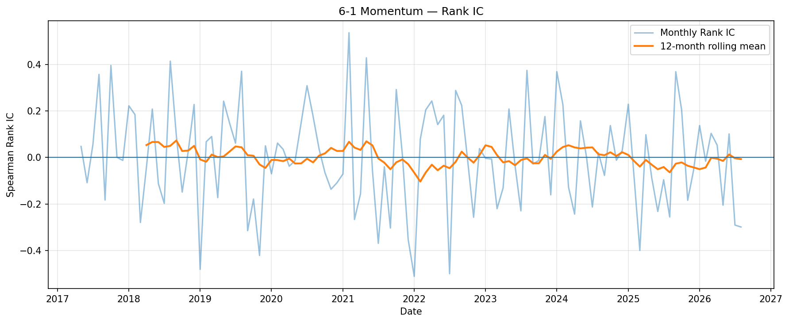
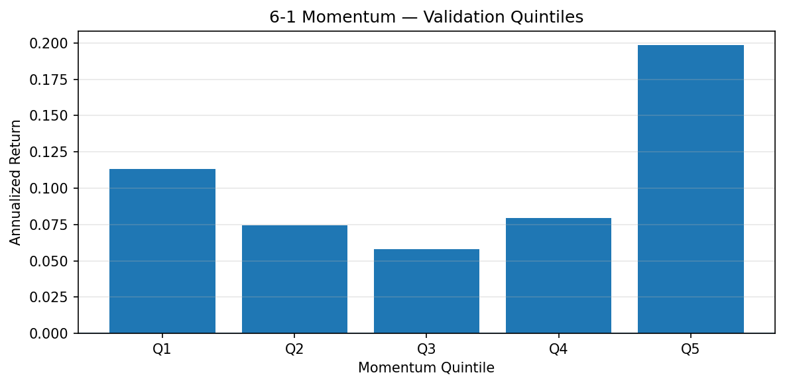
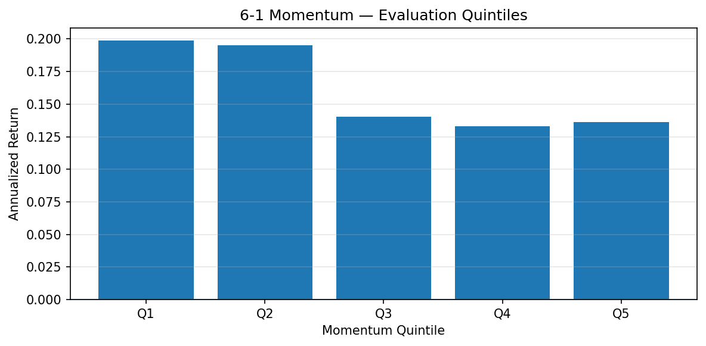
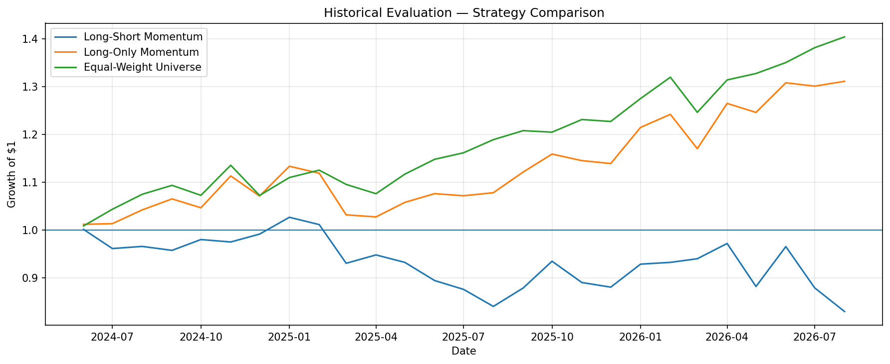
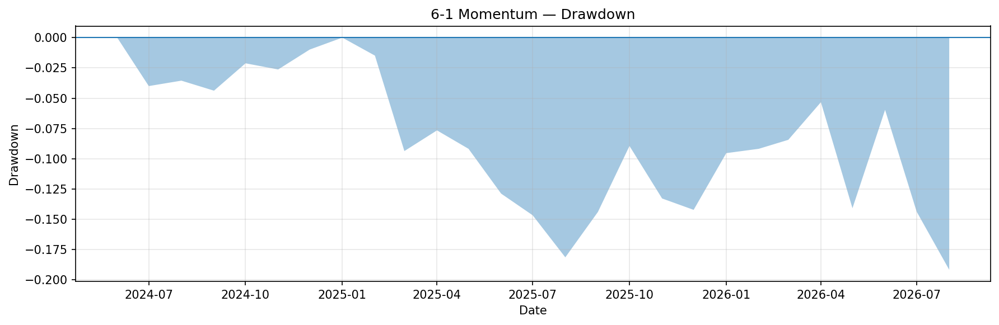

# Cross-Sectional Momentum Factor Research

A research-oriented study of cross-sectional momentum across a broad U.S. equity universe.

The project evaluates 6-1, 9-1 and 12-1 momentum signals using chronological development, validation and historical evaluation periods. Rather than focusing only on backtest returns, the study tests factor robustness using Rank IC, quintile portfolios, long/short leg decomposition, benchmark comparisons, transaction-cost sensitivity, block-bootstrap inference and multiple-testing controls.

## Research Question

Does medium-term cross-sectional momentum provide a stable and economically meaningful signal across U.S. equities?

## Data

- Initial universe: 200 U.S. large-cap equities
- Final clean universe: 193 stocks
- Frequency: monthly
- Sample length: approximately 10 years
- Data source: Yahoo Finance via `yfinance`
- No forward-filling of missing prices
- Stocks with more than 5% missing observations were removed
- Stocks with internal or trailing price gaps were excluded

## Momentum Signals

Three momentum specifications were tested:

- 6-1 Momentum
- 9-1 Momentum
- 12-1 Momentum

The general signal is:

\[
Momentum_t = \frac{P_{t-1}}{P_{t-k}} - 1
\]

where the most recent month is skipped.

## Portfolio Construction

- Long top 20% of stocks ranked by momentum
- Short bottom 20%
- Equal-weight within each leg
- Monthly rebalancing
- Base transaction cost assumption: 10 bps per unit of turnover

The sample was divided chronologically into:

- Development: 50%
- Validation: 25%
- Historical Evaluation: 25%

The validation rule selected the specification with the highest validation Sharpe ratio.

## Factor Validation

The research framework includes:

- Spearman Rank IC
- Quintile portfolio analysis
- Long / Short leg decomposition
- Long-only benchmark
- Equal-weight benchmark
- Gross vs Net return comparison
- Transaction-cost sensitivity
- Centered circular-block bootstrap
- Bonferroni multiple-testing correction

## Key Findings

The 6-1 specification achieved the highest validation Sharpe ratio and was selected for further evaluation.

However, the signal did not exhibit a stable long-short premium during the historical evaluation period.

Historical evaluation results for the selected 6-1 strategy:

- Annualized return: -7.95%
- Annualized volatility: 15.97%
- Sharpe ratio: -0.44
- Maximum drawdown: -19.17%
- Total return: -17.01%

The long/short decomposition showed that the short leg was the primary source of underperformance:

- Long winners annualized return: 13.76%
- Long winners Sharpe: 1.08
- Short losers P&L annualized return: -18.30%
- Loser stocks themselves returned approximately 19.72% annualized

This indicates that past losers experienced strong subsequent rebounds during the evaluation period.

## Selected Figures

### Rank IC

### Validation Quintile Returns

### Historical Evaluation Quintile Returns

### Benchmark Comparison

### Historical Evaluation Drawdown

## Quintile Analysis

The factor did not show stable monotonicity across momentum quintiles.

During validation, the strongest momentum quintile outperformed the weakest quintile, but this relationship reversed during historical evaluation.

Historical evaluation:

- Q1 annualized return: 19.87%
- Q5 annualized return: 13.63%
- Q5 - Q1 annualized spread: -6.60%

This suggests that the momentum effect was regime-dependent over the studied sample.

## Rank IC

Rank IC results were unstable across periods.

For the selected 6-1 signal:

- Development mean Rank IC: -0.0036
- Validation mean Rank IC: 0.0255
- Historical evaluation mean Rank IC: -0.0385

The change in sign across periods indicates weak and unstable cross-sectional predictive power.

## Benchmark Comparison

During historical evaluation:

| Strategy | Annual Return | Sharpe |
|---|---:|---:|
| Long-Short Momentum | -7.95% | -0.44 |
| Long-Only Momentum | 12.78% | 1.01 |
| Equal-Weight Universe | 16.26% | 1.59 |

Long-only momentum remained profitable, but did not outperform a simple equal-weight benchmark.

## Transaction-Cost Sensitivity

The long-short strategy remained negative even before transaction costs:

| Cost | Annual Return | Sharpe |
|---|---:|---:|
| 0 bps | -6.38% | -0.33 |
| 5 bps | -7.17% | -0.39 |
| 10 bps | -7.95% | -0.44 |
| 25 bps | -10.26% | -0.60 |

This suggests that transaction costs worsened performance but were not the main cause of underperformance.

## Bootstrap Inference

A centered circular-block bootstrap was used to evaluate whether the historical evaluation return was statistically distinguishable from a zero-mean null.

For the selected 6-1 strategy:

- Observed monthly mean return: -0.585%
- Observed Sharpe: -0.44
- One-sided p-value for positive mean return: 0.8086
- 95% bootstrap CI for monthly mean: [-1.901%, 0.661%]
- 95% bootstrap CI for Sharpe: [-1.520, 0.580]

The results do not provide statistically convincing evidence of a positive long-short momentum premium.

## Interpretation

The project does not attempt to present an artificially optimized trading strategy.

Instead, it focuses on factor validation and failure diagnosis.

The main findings are:

1. Momentum performance was unstable across time periods.
2. The short leg was the main source of long-short underperformance.
3. Long-only momentum remained positive but did not outperform the equal-weight universe.
4. Rank IC and quintile analysis showed weak and regime-dependent predictive power.
5. Transaction costs were not the primary reason for poor long-short performance.

## Limitations

- The stock universe is based on a fixed set of current equities, introducing survivorship and selection bias.
- Yahoo Finance is not a point-in-time institutional market database.
- Delisting returns are not explicitly modeled.
- Short borrow availability and stock-specific borrow fees are not included.
- Monthly closing prices simplify execution, spreads and market impact.
- The historical evaluation period has already been observed during the research process and is therefore not treated as a fresh untouched out-of-sample test.

## Tools

- Python
- Pandas
- NumPy
- Matplotlib
- yfinance

## Detailed Methodology

For detailed methodology, statistical tests and research limitations, see [methodology.md](methodology.md).

## Code

A reproducible implementation is included in
[`momentum_research.py`](momentum_research.py).

Dependencies are listed in [`requirements.txt`](requirements.txt).
